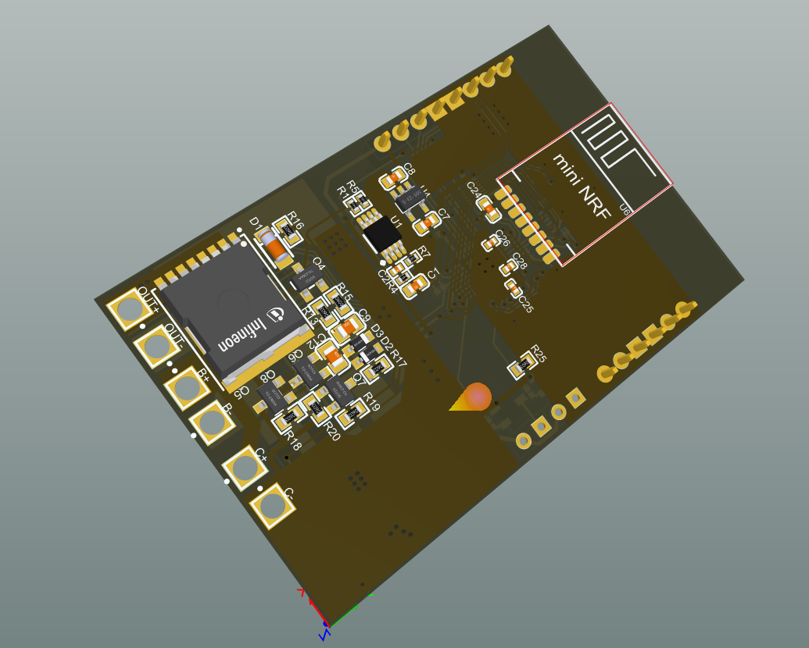
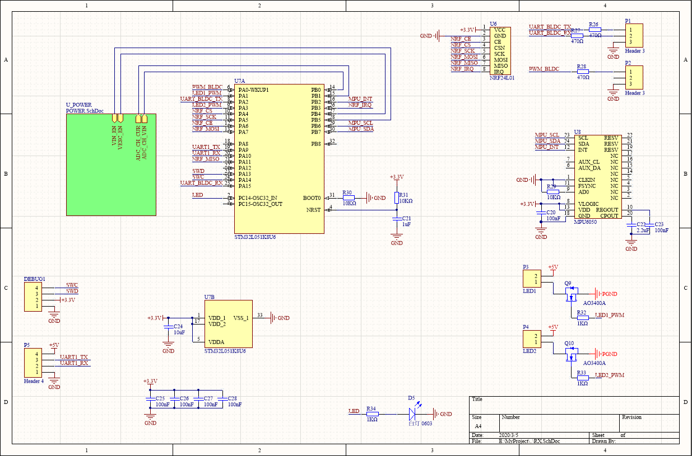
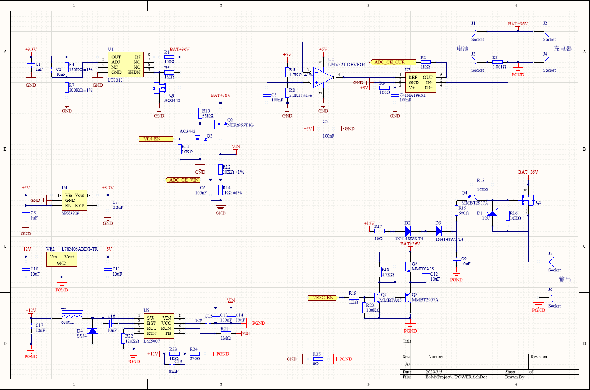

# VESC Remote Controller

This remote controller is used to control the VESC motor controller. It can easily control the electric skateboard equipped with VESC drive.

# Feature
- Low-power Consumption
- Support Remote Power Control
- Real-time Data Backhaul
- Show Real-time packet loss rate
- Battery Current Monitoring
- Input Voltage Range of 12 V to 60 V
- Two LED Headlights
- Reserved UART to Connect Modules such as GPS
- Acceleration Sensor MPU6050

# Hardware

## Receiver PCB

## Receiver  schematic

pdf [doc/RX-V5.0-schematic.pdf](doc/RX-V5.0-schematic.pdf)

## Transmitter model rendering

## transmitter PCB

## transmitter schematic

