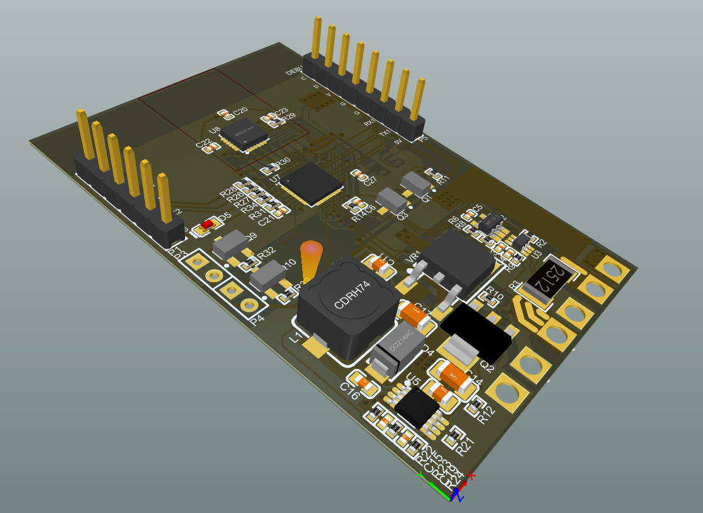
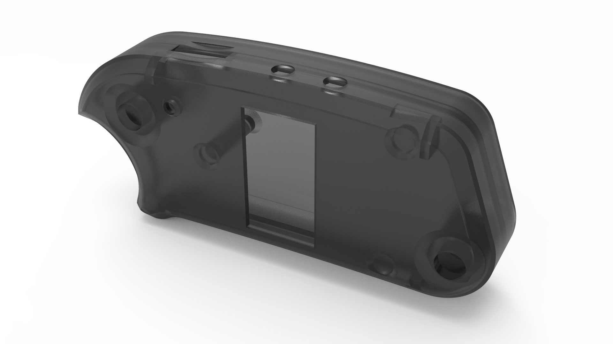
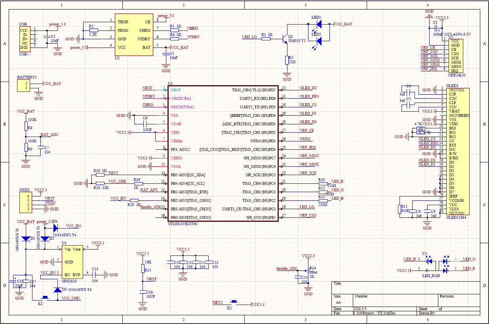

# VESC Remote Controller

This remote controller is used to control the VESC motor controller. It can easily control the electric skateboard equipped with VESC drive.

| Branch | Build Status                                                 |
| ------ | ------------------------------------------------------------ |
| master |  |
| dev    |  |

# Feature
- Low-power Consumption
- Support Remote Power Control
- Real-time Data Backhaul
- Show Real-time packet loss rate
- Battery Current Monitoring
- Input Voltage Range of 12 V to 60 V
- Two LED Headlights
- Reserved UART to Connect Modules such as GPS
- Acceleration Sensor MPU6050

# Repository Structure

- **transmitter**: Transmitter code
- **receiver**: Receiver code
- **image**: pcb or schematic
- **doc**: Documentation

# how to build

Transmitter you need to use IAR IDE to compile, while Receiver uses STM32 to compile with MDK-V5

# Hardware

## Receiver PCB

## Receiver  schematic

PDF [doc/RX-V5.0-schematic.pdf](doc/RX-V5.0-schematic.pdf)

## Transmitter model rendering

## Transmitter schematic

